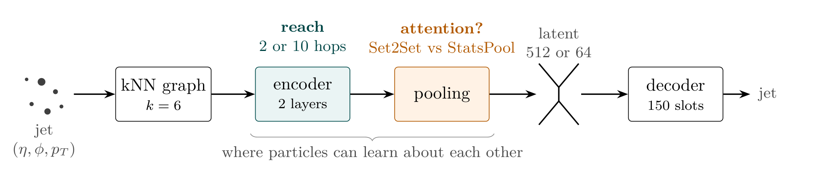
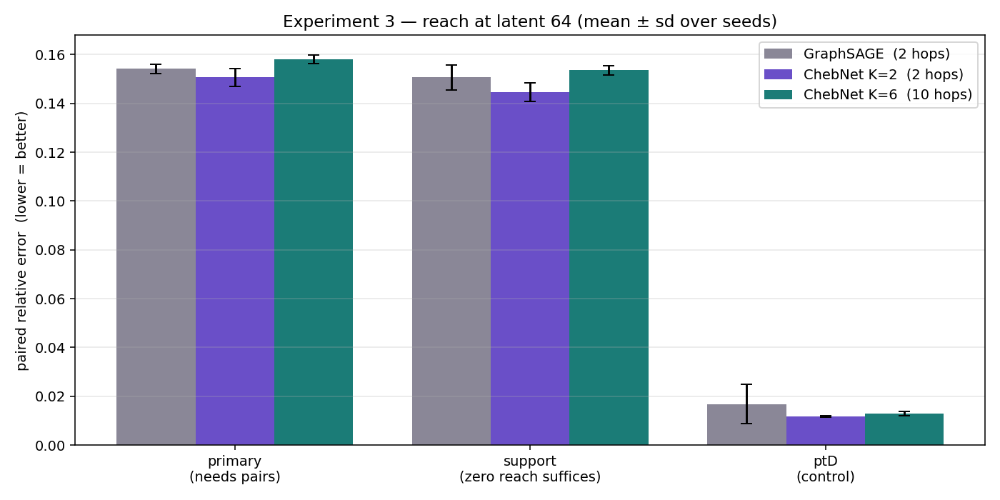

# Graph Autoencoders for Particle Jets

**Does a neural network need to see the whole jet?** This repository holds the
code and results of a Google Summer of Code project that asks this question
with graph autoencoders on the JetNet dataset.

- **Data:** [JetNet150](https://github.com/jet-net/JetNet) — simulated LHC
  jets (gluon, light quark and top), up to 150 particles each, every particle
  described by its position (η, φ) and momentum share (pT).
  368,112 jets for training, 78,882 held-out test jets (JetNet's own split).
- **Model:** a jet becomes a k-nearest-neighbour graph, a graph encoder
  compresses it into a short vector (the *latent*), and a decoder rebuilds the
  jet from that vector alone.
- **Question:** does giving the encoder a wider view of the jet — through a
  longer **reach** (ChebNet order K) or through **attention pooling**
  (Set2Set) — help the compressed jet keep more of its structure?



---

## What's in here

```
generative_pipeline_v15.2/            full generator: autoencoder + latent flow matching
    v_15_2.py                         the whole pipeline in one script
    results/                          loss curves, generated jets, JetNet metrics

experiment_latent512_attention_v16/   Experiment A: attention vs fixed pooling (latent 512)
    code/                             v16 training code
    results/                          GraphSAGE + StatsPool vs GraphSAGE + Set2Set

experiment_latent64_reach_v17/        Experiment B: does reach help? (latent 64, 3 seeds)
    code/                             v17 training, metric suite, aggregation, diagnostics
    results/                          9 runs (3 encoders x 3 seeds) + summary figures
```

Each run folder contains the same outputs: `metrics.json` / `suite.json`
(numbers), `recon_pairs.png` (six real test jets next to their
reconstructions — the same six jets for every model), `dist_comparison.png`,
`observables.png`, `multiplicity.png` and `ae_loss.png`.

---

## How the reconstructions are scored

For every test jet, a physics quantity is computed on the real jet and on its
rebuilt copy:

```
paired relative error = average over jets of |copy − real|  ÷  spread of the real values
```

**0 is perfect; 0.15 means the copy is off by 15% of the normal jet-to-jet
variation.** The quantities are grouped by one test: *can it be computed from
sums over single particles?*

| group | quantity | formula (wᵢ = momentum share) | why it's in this group |
|---|---|---|---|
| **Pairwise** | ECF(2, β=1) | Σᵢ<ⱼ wᵢ wⱼ ΔRᵢⱼ | the √ in ΔR cannot be split into single-particle sums |
| | wide-angle EEC | Σᵢ<ⱼ wᵢ wⱼ · [ΔRᵢⱼ > 0.2] | a yes/no test on a *pair* cannot be split |
| **Per-particle** | ECF(2, β=2) | Σ wᵢ\|xᵢ\|² − \|Σ wᵢ xᵢ\|² | expands exactly into sums: a model that never compares particles gets it right |
| | girth | Σ wᵢ rᵢ | one particle at a time |
| | jet mass | from the summed four-momenta | a function of a few totals |
| **Control** | ptD | √(Σ wᵢ²) | no positions at all — reach cannot affect it |
| **Overall** | EMD, particle count | energy-flow EMD; exact count | whole-jet checks |

*wᵢ = particle i's share of the jet momentum; ΔRᵢⱼ = the angular distance
between particles i and j; xᵢ = (ηᵢ, φᵢ) relative to the jet axis, rᵢ = |xᵢ|.*

**Reading rule:** if a wider view really helps, the *pairwise* errors drop while
the *per-particle* errors and *ptD* stay flat. If everything moves together, one
model simply trained better.

The metric suite lives in `experiment_latent64_reach_v17/code/suite.py`.

---

## Experiment A — attention vs a fixed summary (latent 512)

**Question.** Does learned attention pooling (Set2Set) give the compressed jet
more global information than a fixed summary (StatsPool: sum, mean, max, std)?

**Setup.** GraphSAGE encoder, kNN k = 6, latent 512, 200 epochs, identical
decoder and training. Only the pooling differs. Both models have 2.4 M
parameters (2,401,732 vs 2,400,708). One seed per arm.

| | StatsPool | Set2Set |
|---|---|---|
| pairwise error (mean of ECF β=1, EEC wide) | **0.097** | 0.128 |
| per-particle error (girth, mass, ECF β=2) | **0.088** | 0.123 |
| ptD (control) | **0.010** | 0.023 |
| energy-flow EMD | **0.012** | 0.015 |
| exact particle count | **99.0%** | 81.0% |
| final training loss | **0.0105** | 0.0219 |


**Takeaway: attention made every number worse**, including the control and
the particle count. The gap stays the same even on jets where both models
count correctly, and the Set2Set model trained to twice the loss.

---

## Experiment B — does reach help? (latent 64)

**Question.** If the encoder can see 10 hops across the jet instead of 2, does
it keep more pairwise structure?

**Setup.** Each jet is squeezed into **64 numbers** — less than a typical jet
holds (~56 particles × 3 ≈ 169 numbers), so the encoder must choose what to
keep. Undirected kNN(6) graph, 2 layers, StatsPool, 200 epochs, 3 seeds each.
Reach = layers × (K − 1).

| model | reach | params | pairwise error | per-particle error | ptD (control) |
|---|---|---|---|---|---|
| GraphSAGE | 2 hops | 967,236 | 0.154 ± 0.002 | 0.151 ± 0.005 | 0.017 ± 0.008 |
| ChebNet K=2 | 2 hops | 967,236 | **0.151 ± 0.004** | **0.145 ± 0.004** | **0.012 ± 0.000** |
| ChebNet K=6 | 10 hops | 1,491,524 | 0.158 ± 0.002 | 0.154 ± 0.002 | 0.013 ± 0.001 |

Mean ± standard deviation over 3 seeds. Every individual metric, with t-tests
between models, is in `results/results_reach.md`.



**Takeaway: seeing 10 hops instead of 2 gives no benefit.** K = 6 is slightly
worse, but equally worse on the per-particle quantities that need no reach at
all — it trained a little less well. GraphSAGE and ChebNet K = 2 (same reach,
same size) are equal within seed noise.

**Why** (from `code/diagnostic.py`, run on the cluster):

- **Per-particle sums are nearly enough.** Using only sums over single
  particles, a tree model predicts ECF(2, β=1) with error 0.034 — five times
  better than any autoencoder rebuilds it (≈0.17).
- **Reach adds nothing to the latent.** A small network reading ECF(2, β=1)
  straight from the frozen 64 numbers does equally well for K = 2 and K = 6
  (0.073 vs 0.076).
- **The decoder is the bottleneck.** The latent holds about twice as much as
  the decoder rebuilds, for every encoder alike.

---

## The generative pipeline (v15.2)(Still work in progress)

The full generator: autoencoder + a **conditional flow-matching model on the
latent**. New jets are made by sampling a latent from noise and decoding it.

| part | setting |
|---|---|
| graph | kNN k = 10 (directed) |
| encoder | 4 × Euler-ChebConv (K = 10), anti-symmetric weights, Set2Set pooling, latent 512 |
| decoder | 150-slot decoder with self-attention, STE hard mask, pT normalised over active particles, η/φ bounded to ±2 |
| AE loss | Sinkhorn (η, φ, 10·pT) + mask BCE + multiplicity count loss, 300 epochs |
| flow | conditional flow matching on the latent: 8 FiLM blocks × 2048 hidden, conditioned on jet type, jet pT, jet mass and multiplicity; 1000 epochs; 750 Euler steps to sample |

**JetNet metrics** (`results/eval_jetnet_metrics.json`, 25k jets, all three

**Status: not yet competitive.** The generative modeling is still in progress after knowing about the best pooling methods and reach methods, we have now started to work on generative modelling,
in this domain we have two competitive architectures the EPIC-FM and EPIC-GAN, wherein the EPIC-FM uses the flow matching model and directly works on particle space leading to slower generations per jet, 
EPIC-GAN works on GAN architecture, giving fast results, but the architecture is itself unreliable so we try to use flow matching model on a latent space and reconstruct this generated latent jet to original jet 
using the learned decoder, reducing time than EPIC-FM and being more reliable and stable architecture. The experiment is still in progress on this.

---

## Lessons learned between versions

| version | change | why it mattered |
|---|---|---|
| v15 → v15.2 | η/φ bound 0.8 → 2.0; straight-through hard mask; count loss | 0.8 clipped real particles; multiplicity was unconstrained |
| v15.2 → v16 | flow removed; Set2Set replaced by StatsPool in the main arm; reconstruction metrics | isolate what the *encoder* contributes |
| v16 → v17 | **undirected kNN graph** | sklearn's kNN graph is directed; ChebNet's Chebyshev terms then grow with K, penalising large K for reasons unrelated to reach |
| v16 → v17 | metrics sorted into pairwise / per-particle / control | girth, mass and ECF(β=2) factorise and cannot test reach |

---

## Running the code

All training ran on NERSC Perlmutter (A100 GPUs) with SLURM. Paths at the top
of each script point to the original cluster locations — set them for your
system:

```bash
export JETNET_DATA_DIR=/path/to/jetnet_data       # JetNet downloads here
export ABLATION_SAVE_ROOT=/path/to/results        # run folders + graph caches
```

Requirements: `torch`, `torch_geometric`, `geomloss`, `jetnet`, `energyflow`,
`scikit-learn`, `scipy`, `matplotlib`, `numpy`.

The SLURM scripts are kept exactly as they ran, so they expect the code
folder under its original name: **`v17_final/`** for Experiment B and
**`v16_ablation/`** for Experiment A. Copy it to that name and submit from the
folder that contains it.

**Experiment B (v17)**

```bash
cp -r experiment_latent64_reach_v17/code v17_final
sbatch --array=0 v17_final/slurm_reach.sh     # first job builds the graph cache
sbatch --array=1-8 v17_final/slurm_reach.sh   # then the other eight
python v17_final/aggregate.py --reach $ABLATION_SAVE_ROOT --out summary/
```

A single run: `python v17_final/ae_core.py --tag demo --conv cheb --K 2 --latent-dim 64`.
`code/README.md` is the original v17 notes; it also describes a latent-size
scout that is not part of this repository.

**Experiment A (v16)**

```bash
cp -r experiment_latent512_attention_v16/code v16_ablation
sbatch v16_ablation/slurm_local.sh     # StatsPool arm
sbatch v16_ablation/slurm_global.sh    # Set2Set arm
```

Each script trains GraphSAGE, ChebNet K=4 and ChebNet K=8 in turn; only the
GraphSAGE runs are reported here. See `code/README.md`.

**Generative pipeline (v15.2)** — edit the two paths at the top of
`v_15_2.py`, then `python v_15_2.py`.

---

## References

- R. Kansal et al., *Particle Cloud Generation with Message Passing GANs*, NeurIPS 2021 (JetNet).
- A. Hariri et al., *Graph Generative Models for Fast Detector Simulations in Particle Physics*, NeurIPS ML4PS 2020.
- E. Buhmann, G. Kasieczka, J. Thaler, *EPiC-GAN: Equivariant Point Cloud Generation for Particle Jets*, SciPost Phys. 15, 130 (2023).
- M. Defferrard, X. Bresson, P. Vandergheynst, *Convolutional Neural Networks on Graphs with Fast Localized Spectral Filtering*, NeurIPS 2016.
- W. Hamilton, R. Ying, J. Leskovec, *Inductive Representation Learning on Large Graphs*, NeurIPS 2017.
- O. Vinyals, S. Bengio, M. Kudlur, *Order Matters: Sequence to Sequence for Sets*, ICLR 2016 (Set2Set).
- A. Larkoski, G. Salam, J. Thaler, *Energy Correlation Functions for Jet Substructure*, JHEP 06 (2013) 108.
- P. Komiske, E. Metodiev, J. Thaler, *Metric Space of Collider Events*, PRL 123 (2019) 041801.

## Acknowledgements

This work was done during Google Summer of Code with [organisation], mentored
by [mentor names]. Computing resources: NERSC.
